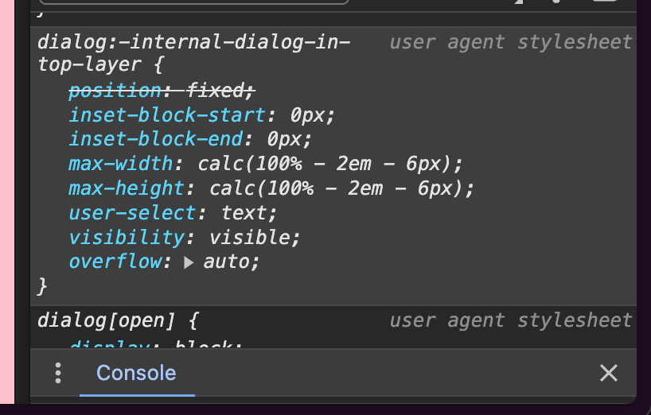

fix: modal does not close unless the dialog backdrop is clicked (including dangling content)

fix: polyfilled popovers render correctly inside of modals.

fix: nested modals will now close the current modal when the backdrop is clicked.

fix: nested modals will now close the current modal when the escape key is pressed.

fix: select does not execute code until interaction (including core).

tests: larger test suite for modals.

deprecated: `ModalHeader`, `ModalContent`, `ModalFooter` have been deprecated, as they do not pose significant a11y advantages.

feat: Two new Modal component pieces. `ModalTitle` and `ModalDescription`. These help give our modal an accessible name and supporting description (optional).

feat: Modal now uses the following CSS as a default inside of an @layer

```css
@layer qwik-ui {
  /* browsers automatically set an interesting max-width and max-height for dialogs 
    https://twitter.com/t3dotgg/status/1774350919133691936
  */
  dialog:modal {
    max-width: unset;
    max-height: unset;
  }
}
```

The default browser styles:



Make it difficult to style a dialog element full-screen, which has led to some confusion recently both in this repo and across the web. The above change strips the responsible browser styles from the dialog eleemnt (which is used by Qwik UI's modal component).

> For more info, feel free to check out the link in the code snippet above.

> Note: In the future, we intend to use the dot notation for the `Modal` component.

> Note: In the future, we intend to change the modal API to include a trigger. The proposed API is as follows:

### Syntax Proposal

```tsx
<Modal.Root>
  <Modal.Trigger>Trigger</Modal.Trigger>
  <Modal.Panel>
    {/*  This is the current <Modal /> */}
    <Modal.Title>Edit Profile</Modal.Title>
    <Modal.Description>You can update your profile here.</Modal.Description>
  </Modal.Panel>
</Modal.Root>
```

Let us know your thoughts on this potential API change in the Qwik UI discord!
